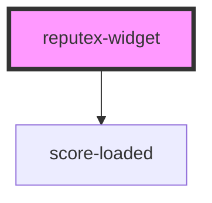

# reputex-widget

<!-- Auto Generated Below -->

## Properties

| Property       | Attribute        | Description | Type      | Default     |
| -------------- | ---------------- | ----------- | --------- | ----------- |
| `apiAccessKey` | `api-access-key` |             | `string`  | `undefined` |
| `apiSecretKey` | `api-secret-key` |             | `string`  | `undefined` |
| `mode`         | `mode`           |             | `boolean` | `undefined` |
| `userAddress`  | `user-address`   |             | `string`  | `undefined` |
| `visibility`   | `visibility`     |             | `boolean` | `undefined` |

## Dependencies

### Depends on

- [score-loaded](../score-loaded)

### Graph

----------------------------------------------

*Built with [StencilJS](https://stenciljs.com/)*
