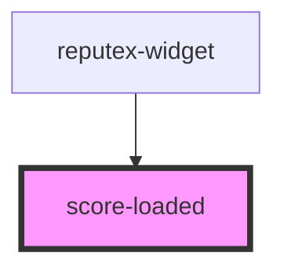

# score-loaded

<!-- Auto Generated Below -->

## Properties

| Property       | Attribute        | Description | Type      | Default     |
| -------------- | ---------------- | ----------- | --------- | ----------- |
| `isDid`        | `is-did`         |             | `boolean` | `undefined` |
| `lastUpdated`  | `last-updated`   |             | `string`  | `undefined` |
| `mode`         | `mode`           |             | `boolean` | `undefined` |
| `reputeXScore` | `repute-x-score` |             | `number`  | `undefined` |
| `userAddress`  | `user-address`   |             | `string`  | `undefined` |

## Dependencies

### Used by

 - [reputex-widget](../reputex-widget)

### Graph

----------------------------------------------

*Built with [StencilJS](https://stenciljs.com/)*
